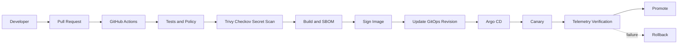

# Deployment Flow

```mermaid
flowchart LR
    Dev[Developer] --> PR[Pull Request]
    PR --> CI[GitHub Actions]
    CI --> Test[Tests and Policy]
    Test --> Scan[Trivy Checkov Secret Scan]
    Scan --> Build[Build and SBOM]
    Build --> Sign[Sign Image]
    Sign --> GitOps[Update GitOps Revision]
    GitOps --> Argo[Argo CD]
    Argo --> Canary[Canary]
    Canary --> Verify[Telemetry Verification]
    Verify --> Promote[Promote]
    Verify -. failure .-> Rollback[Rollback]
```

Production changes require explicit approval.
