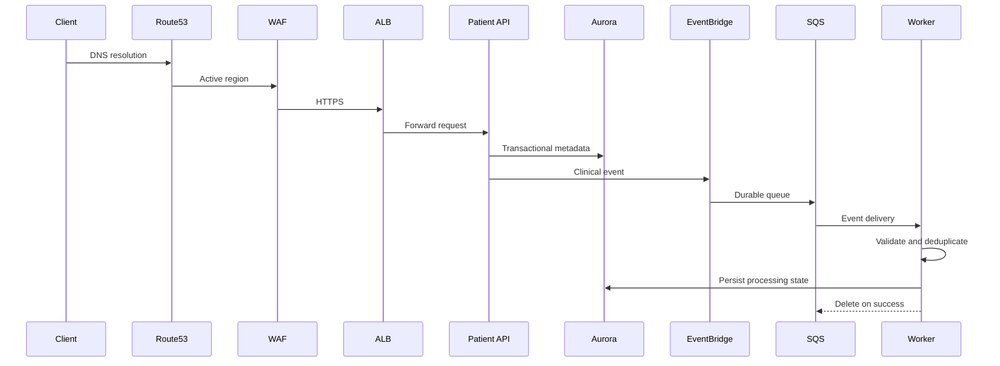

# Request and Event Flow

```mermaid
sequenceDiagram
    participant C as Client
    participant R as Route53
    participant W as WAF
    participant L as ALB
    participant A as Patient API
    participant D as Aurora
    participant E as EventBridge
    participant Q as SQS
    participant P as Worker

    C->>R: DNS resolution
    R->>W: Active region
    W->>L: HTTPS
    L->>A: Forward request
    A->>D: Transactional metadata
    A->>E: Clinical event
    E->>Q: Durable queue
    Q->>P: Event delivery
    P->>P: Validate and deduplicate
    P->>D: Persist processing state
    P-->>Q: Delete on success
```

The client receives a synchronous response while noncritical downstream work
can continue asynchronously.
